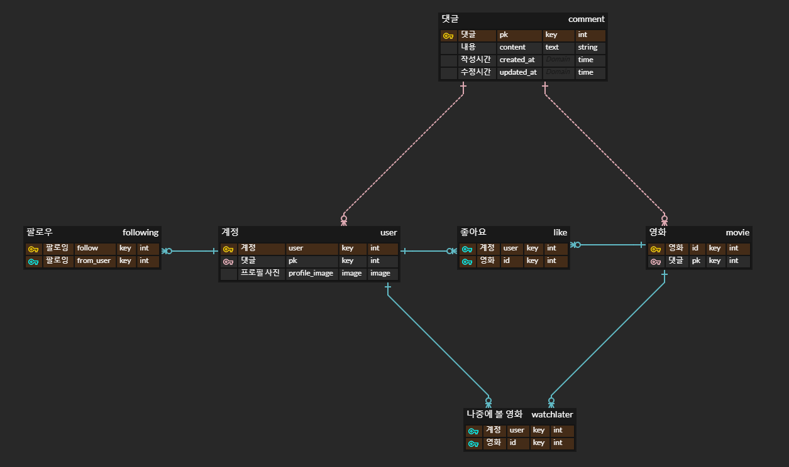
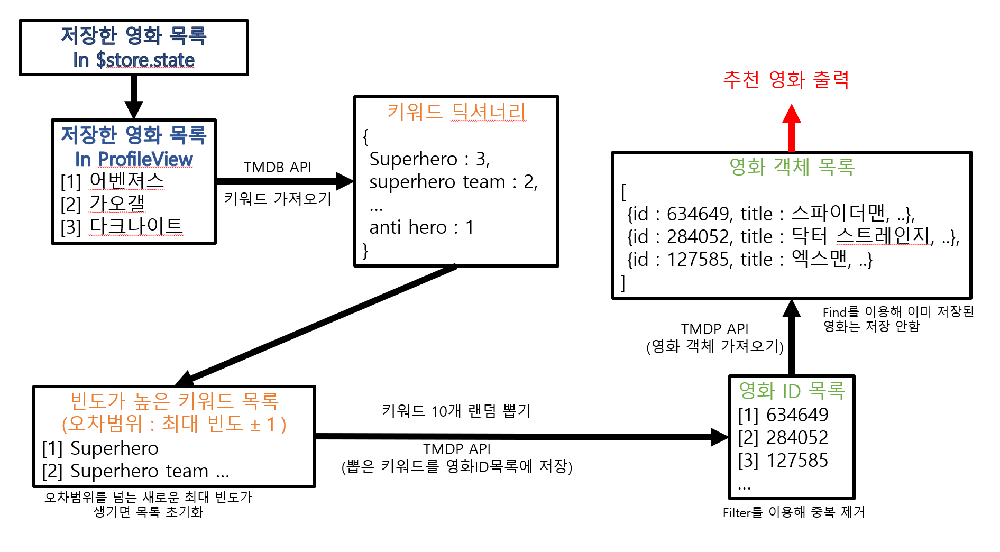

## MORE

## 프로젝트 진행 기간
2023.05

## MORE 소개
당신이 원하는 더 많은 영화, MORE

## MORE 기능
### 🎥 장르별 영화 찾기
- TMDB API를 통해 장르별 영화 탐색
- 인피니티 스크롤을 통해 더 많은 영화 추천 받기

### 📥 나중에 볼 영화 저장
- 보고싶은 영화 저장
- 토글을 통해 모든 페이지에서 저장한 영화 확인

### 🍒 저장한 영화를 기반으로 영화 추천
- 빈도가 높은 저장한 영화 키워드 목록
- 오차범위 내에서 랜덤으로 뽑기
- 뽑은 키워드에 해당하는 영화 추천

## 기술 스택
    

## 

<!-- #### ERD
 -->

<!-- #### 영화추천 알고리즘
 -->

|메인페이지|메인페이지|
|:---:|:---:|
|  |  |
| 장르별 영화 탐색 | 인피니티 스크롤|

|회원가입|로그인|
|:---:|:---:|
|  |  |

|영화 정보 페이지|영화 정보 페이지|
|:---:|:---:|
|  |  |
| 영화 저장 & 좋아요 & 예고편 | 댓글 수정 & 삭제|

|마이페이지|마이페이지|
|:---:|:---:|
|  |  |
| 저장한 영화 기반   영화 추천 받기| 프로필 수정|

|영화 저장 토글|영화 검색|
|:---:|:---:|
|  |  |
| 모든 페이지에서 저장한 영화 확인| 원하는 영화 검색|

## 팀원 소개
#### [박희창](https://github.com/prkhch) FE

#### [최찬석](https://github.com/ChoiCharles) BE
