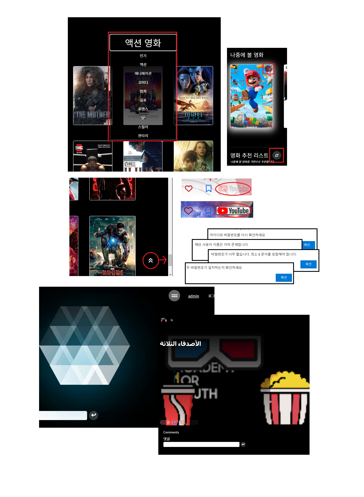

## 영화 추천@저장 플랫폼
2023.05.17(수) ~ 2023.05.26(금)

##### 박희창/최찬석

---

#### ERD

#### 영화추천 알고리즘

- ## DAY-9

FE

- 홈(장르 분류, TOP버튼)
- 로딩 처리
- 프로필(저장영화 삭제, 추천영화 새로고침, 비밀번호 수정)
- 예고편 없는 영화, 포스터 없는 영화 처리
- 로그인, 회원가입 더 자세한 알림

BE

- 비밀번호 수정
- 디버깅
- 예외 처리

- ## DAY-8

FE

- 프로필 수정
- 프로필(저장한 영화)
- 프로필(저장한 영화를 기반으로한 영화 추천)
- 저장한 영화 메뉴 드래그 앤 드롭

BE

- 프로필 수정
- 댓글 이미지

- ## DAY-7

FE

- 나중에 볼 영화(저장, store.state를 이용하여 모든 url에서 호출 가능)
- 댓글 수정
- 프로필

BE

- 프로필 이미지

- ## DAY-6

FE

- 나중에 볼 영화(드롭다운)

BE

- 댓글 수정
- 프로필
- 프로필 수정
- 비밀번호 변경

- ## DAY-5

FE

- 좋아요
- 나중에 볼 영화 저장
- 애니메이션 효과

BE

-  나중에 볼 영화
-  팔로우
-  좋아요 수

- ## DAY-4

FE

- 홈페이지, 상세페이지 레이아웃

BE

- 영화 좋아요

## DAY-3

FE

- 인피니트 스크롤(홈페이지)

- 상세페이지(댓글 작성 및 삭제)

- 로그인, 회원가입

BE

- 모델 수정 및 업데이트(유저, 영화, 댓글, 저장한 영화)

- 댓글 작성 및 삭제

## DAY-2

FE 

- 홈페이지

- 상세페이지(영화 정보)

BE 

- 모델 생성

- TMDB API를 통해 영화 DB 불러오기 및 저장

- 영화 상세페이지 읽기

- 로그인, 회원가입

## DAY-1

- 기획
- 프로젝트 생성
