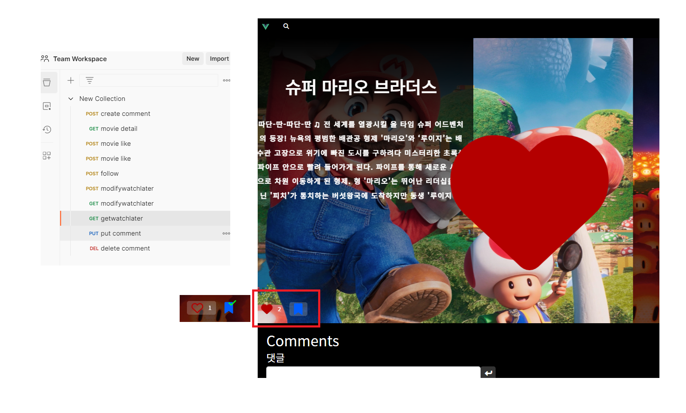

# 싸피_9기_관통프로젝트

## 프로젝트 이름

##### Django, Vue.js

##### ERD

img

##### Component

img

- 박희창,최찬석

- ## DAY-6

FE

- 나중에 볼 영화(드롭다운)

BE

- 댓글 수정
- 프로필
- 프로필 수정
- 비밀번호 변경

- ## DAY-5

FE

- 좋아요
- 나중에 볼 영화 저장
- 애니메이션 효과

BE

-  나중에 볼 영화
-  팔로우
-  좋아요 수

- ## DAY-4

FE

- 홈페이지, 상세페이지 레이아웃

BE

- 영화 좋아요

## DAY-3

FE

- 인피니트 스크롤(홈페이지)

- 상세페이지(댓글 작성 및 삭제)

- 로그인, 회원가입

BE

- 모델 수정 및 업데이트(유저, 영화, 댓글, 저장한 영화)

- 댓글 작성 및 삭제

## DAY-2

FE 

- 홈페이지

- 상세페이지(영화 정보)

BE 

- 모델 생성

- TMDB API를 통해 영화 DB 불러오기 및 저장

- 영화 상세페이지 읽기

- 로그인, 회원가입

## DAY-1

- 기획
- 프로젝트 생성